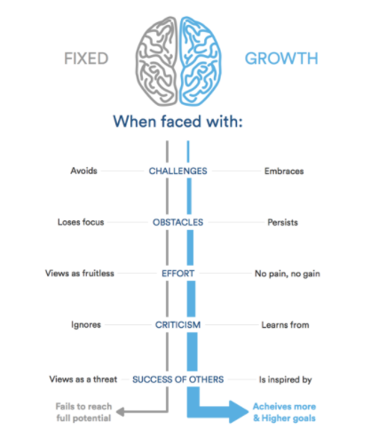

## Welcome to GitHub Pages

# raeding-note 

|   read     |   link       |
------------ | -------------
read02a| [click her](raed02a)
read02b | [click her](read02b)

 #  growth mindset 
 A growth mindset believes that one’s fundamental abilities can be developed through perseverance and effort ,intelligence and talent
 that mean for me (my passion)
 for about my self that is mean go to the work hard go to work ang thing you can do ang thing if you want i alawys a passion in every thing start it 
 I do not have any thing can not do 
 ##  Challenges 
  I chanllege MY self to improve  MY yourself 
  ### Obstacles 
  When I have obstacles I Will exit from mode bad i will do ang thing 
   ### Effort
   I Work evey day for 15 hour that is very hard but i am Continuous

   ## Here’s a simple illustration highlighting the differences between a fixed and a growth mindset:

   
   